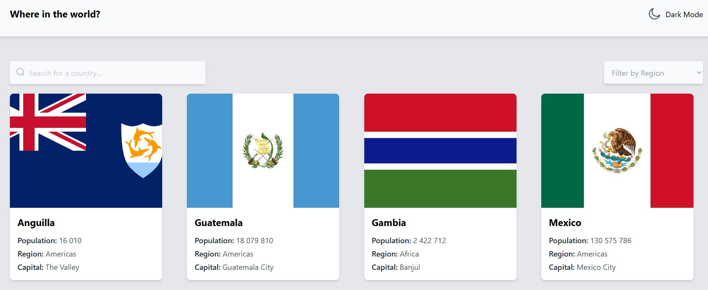

# REST Countries 🌍

Frontend application built with React and Tailwind CSS using the REST Countries API.

## Overview

This project allows users to search and explore countries around the world using data from the REST Countries API.

Users can:
- Search for countries by name
- Filter countries by region
- View detailed country information
- Switch between light and dark mode
- Use the application on all screen sizes

## Screenshot

## Built With

- React
- React Router
- Tailwind CSS
- Vite
- REST Countries API

## Features

- Responsive design
- Dynamic routing
- Dark mode
- API integration
- Country detail pages
- Search and filtering

## Installation

npm install
npm run dev

## Live Demo

(https://terezl.github.io/REST-countries/)

## Author

GitHub: https://github.com/TerezL
